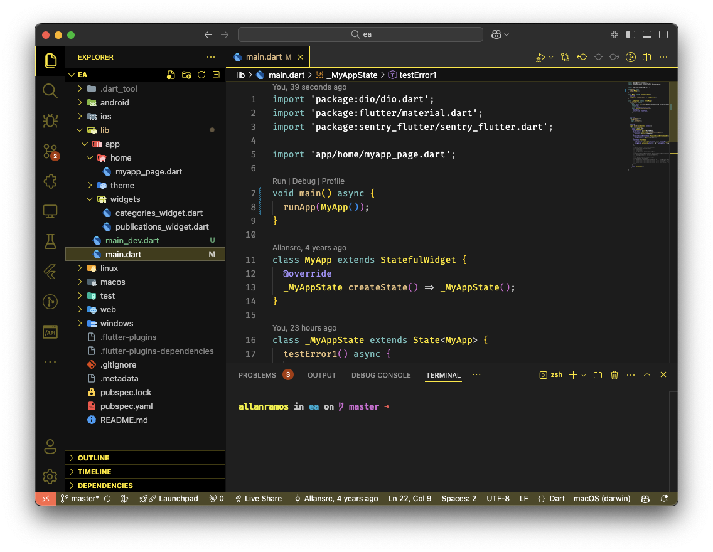

<h1>
DuckDevLabs Theme
</h>

  

## Install

1. Go to [VS Marketplace](https://marketplace.visualstudio.com/items?itemName=GitHub.github-vscode-theme).
2. Click on the "Install" button.
3. Enjoy it!

Publish (internal)
Note: Publishing a new version of this theme is only meant for maintainers.

This repo uses changesets to automatically make updates to CHANGELOG.md and publish a new version to the VS Marketplace.

## Contribute

1. Clone and open this [repo](https://github.com/allansrc/duckdevlabs-theme) in VS Code
2. Run `yarn` to install the dependencies.
3. Press `F5` to open a new window with your extension loaded
4. Open `Code > Preferences > Color Theme` [`⌘k ⌘t`] and pick the "DuckDevLabs" theme to test.
5. Make changes to the [`/src/theme.js`](https://github.com/allansrc/duckdevlabs-theme/blob/master/src/themes/DuckDevTheme-color-theme.json) file.
    - **UI**: For all changes, like (status bar, file navigation etc.), take a look at the [Theme Color](https://code.visualstudio.com/api/references/theme-color) reference.
    - **Syntax**: For changes to the "code highlighting", examine the syntax scopes by invoking the [`Developer: Inspect Editor Tokens and Scopes`](https://code.visualstudio.com/api/language-extensions/syntax-highlight-guide#scope-inspector) command from the Command Palette (`Ctrl+Shift+P` or `Cmd+Shift+P` on Mac) in the Extension Development Host window.
6. Run `yarn build` to update the theme. You can also run `yarn start` instead to automatically rebuild the theme while making changes and no reloading should be necessary.
7. Once you're happy, commit your changes and open a PR.

Note:

- If possible use colors from [Primer's color system](https://primer.style/primitives/colors).

**Enjoy!**
